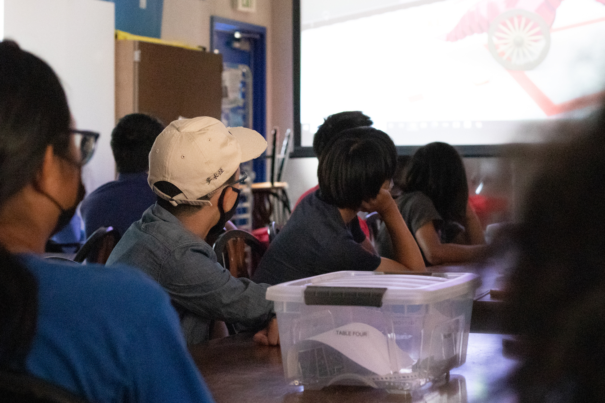

<small class="text-muted">Computer Science Club President Katey Nguyen leads a club meeting on Sept. 28. Photo by Kevin Doan.</small>

 

<b><i>By Kevin Doan</i></b>

 

Amidst growing interest in computer science (CS), Fountain Valley High School (FVHS) added another class of CS to the 2021–2022 academic year, updating this year’s sum total to five classes of CS.

 

The CS program currently comprises three courses: the introductory Exploring Computer Science, Advanced Placement (AP) Computer Science Principles courses and the more advanced AP Computer Science A course. Exploring Science is an intro, survey course that teaches basic CS concepts (i.e. web design, the internet, etc.). AP Computer Science Principles is an introductory, college-level course similar to Exploring Computer Science that teaches CS via mobile development and services like Code.org. AP Computer Science A is an advanced college-level Java programming course.

 

The two previous academic years (2020–2021 and 2019–2020) also saw the addition of a CS class each year; it was a difficult feat that both CS teachers, Eduard Lavrov, who teaches a single class of each course, and Ryan Pham, who teaches two classes of AP Computer Science Principles, fought for.

 

“It’s serendipitous that we have [another class of CS]. It’s not like next year we’ll have six, seven, eight [classes],” Lavrov said. “We’re very lucky that we’re able to do that and we had to work really hard to figure out how to make that happen. We’re trying our best to do that because we know that there’s a demand for it.”

 

That demand for CS has driven the addition of more classes of the introductory AP Computer Science Principles course but not necessarily more classes of the advanced AP Computer Science A course.

 

“You can’t have two of the [AP Computer Science A] courses, and only one [introductory course] that’s kind of feeding into those two courses…how do you have one class that’s gonna fill two,” Lavrov said. “This year, instead of having two [AP Computer Science] A’s I have two intro [courses]. So theoretically, now I can add more [AP Computer Science] A’s, but getting [classes] is very challenging.”

 

Currently, the only assured way a student may reserve a place in the more advanced course is to follow the Software Development pathway under the Career Technical Education (CTE) program run by the business department. The pathway requires that a student first take Exploring Computer Science then AP Computer Science A. There is currently no pathway for AP Computer Science Principles to feed into AP Computer Science A leaving the vast majority of CS students—3 classes worth—no guaranteed route to further CS instruction. This lack of guarantee has created a choke point that has tinctured AP Computer Science A with selectivity.

 

“Almost 80 people want to take [AP Computer Science A] and I only have 37 spots. And of those 37 spots, there were 17 that came from Exploring Computer Science, which was the only thing available last year that would feed into that,” Lavrov said. “This year, since I am teaching two of those intro courses, it’s going to be way tougher next year because now I got two classes feeding into [AP Computer Science A], so there’ll be a lot more reserved spots. Maybe there could be 20 reserved spots and there might be only 10 or 15 open spots.”

 

One cause of the discontinuity between AP Computer Science Principles and AP Computer Science A is the bifurcated instruction of AP Computer Science Principles under the math department—where two classes are taught by Pham—and the business department—where one class is taught by Lavrov. This issue is an ongoing topic of discussion within the business department.

 

<small class="text-muted">Computer Science Club members get acquainted with the format of future robotics competitions by watching a video. Photo by Kevin Doan.</small>

 

Computer Science Club members get acquainted with the format of future robotics competitions by watching a video. Photo by Kevin Doan.
In the meantime, students and teachers work to overcome the choke point by organizing CS education outside of the classroom and in clubs.

 

“I think that [CS at FVHS] can definitely be improved on,” said Junior Katey Nguyen, president of the Computer Science Club, a curricular club advised by Pham that accompanies the AP Computer Science Principles course. “It is a very exclusive program and I very much want to change that so that every Baron and every person in our community is able to participate.”

 

Students and teachers are also working to remedy another ailment of CS: gender disparity. According to the 2020 Current Perspectives and Continuing Challenges in Computer Science Education in U.S. K-12 Schools Report by Gallup, done in conjunction with Google, CS faces a 13% confidence gap between boys and girls—73% of boy respondents said that they were “confident they can learn computer science” compared to 60% of girl respondents. Students and teachers are attempting to make CS more equitable by creating a more inclusive environment, irrespective of gender.

 

“[We have to] be very inclusive here at Fountain Valley, and in doing so, I hope that more girls and women feel that it is okay if they don’t know anything [about CS] because you can [learn CS] without any experience,” Nguyen said.

 

One way to do this is to artificially increase the concentration of female students in CS classes by giving them a slight preference in admission. Lavrov assures that this process won’t drastically further the class’s selectivity.

 

“I have only nine females in my computer science class and the rest are male out of 37, so it’s not like they’re taking over because of that slight preference,” Lavrov said. “It’s not like people are losing their spots because a female took their spot or anything like that. There weren’t really a lot of females to even bring in to begin with.”

 

Despite these efforts, Lavrov saw a dip in his female students this year, although he asserts that it is unclear whether that dip is a result of more females entering CS courses taught by Pham or lower female interest in CS.

 

FVHS may also see the addition of a robotics class in the future. Pham has worked with feeder schools for the last four years to encourage CS education at a younger age—a task he believes will help students find out earlier if they enjoy CS or not, and if they do, pursue it sooner. He is also working with the feeder schools’ robotics programs in order to handcraft a more fitting program at FVHS. One offshoot of this is the Computer Science club which shares a similar vision and is led by Nguyen who is a former student of one of the feeder schools, Fulton Middle School.

 

“I hope to see robotics as something that is concrete; I hope to see it as a class and I hope to see many students interested in joining that class,” Nguyen said.

 

Through all the trials and tribulations that CS at FVHS has been through, Lavrov and Pham maintain that the way forward is to continue to listen to and advocate for students, and to educate the decision-makers, particularly those at the district level, on the reality of the situation.

 

“I would suggest [students go] to board meetings…and bring [CS] up and say, ‘I think there should be CS in our schools,’” Lavrov said. “[The district doesn’t] know that so many people want CS. You [have to] get that word out and maybe be organized; connect to the schools, talk to Marina, talk to Edison, Huntington Beach, see what it’s like over there…and then, if you do notice a pattern, then you have something to bring to the board.”
